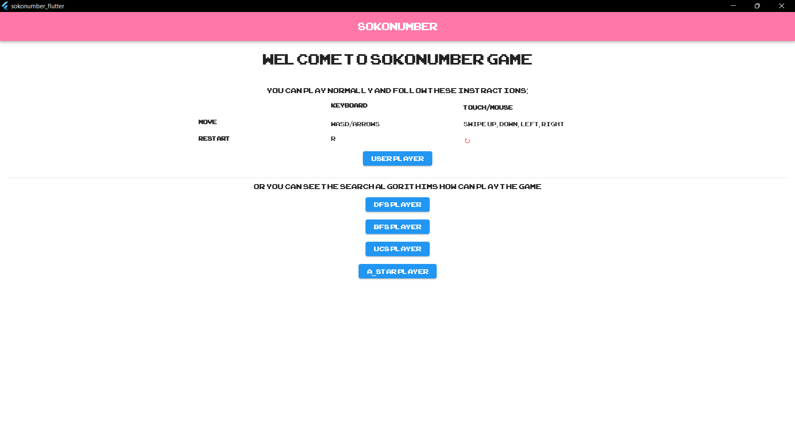
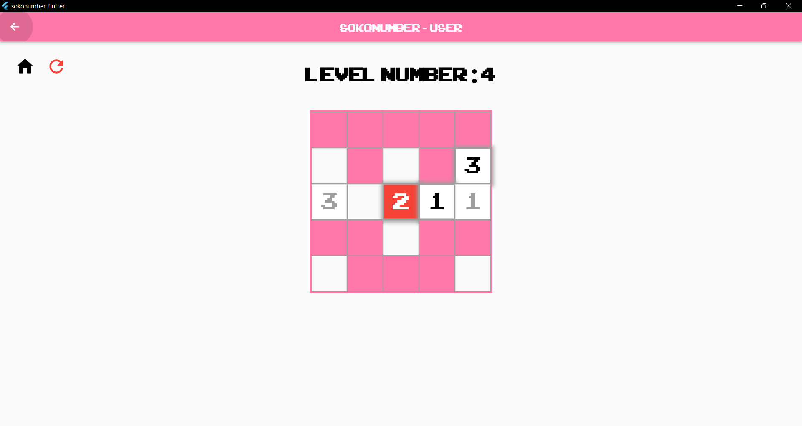
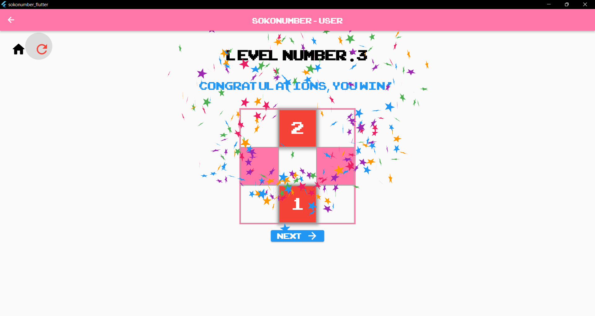
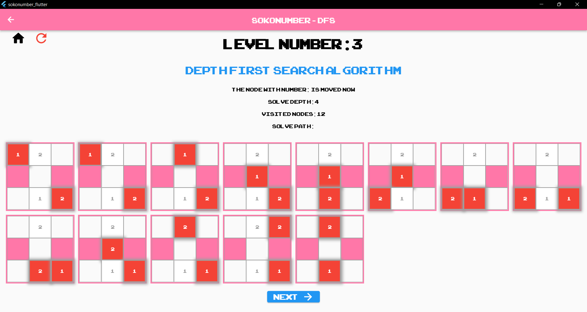
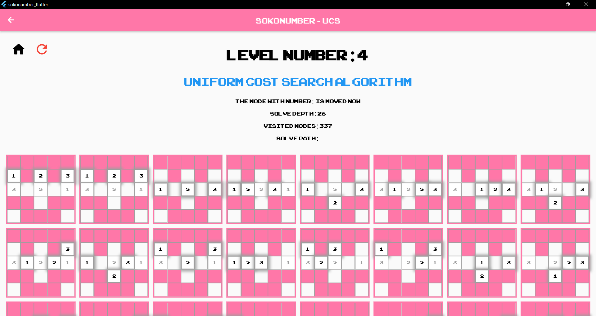

# Sokonumber-Flutter
A flutter application about sokonumber game which allows the **User** to play normally or play and see as a **Search Algorithm** which can be one of the following algorithms:
- DFS (Depth First Search) Algorithm.
- BFS (Bridth First Search) Algorithm.
- UCS (Uniform Cost Search) Algorithm.
- A* (A Star) Algorithm.

#### Compatible with **Android, IOS, Web, Windows** platforms.

### Features 🚀
- the game contains many levels.
- play as a normal gamer start with the level 1.
- track the selected search algorithm results start with the level 3.

## Functional Description
- DFS: Depth-first search is an algorithm for traversing or searching tree or graph data structures. The algorithm starts at the root node (selecting some arbitrary node as the root node in the case of a graph) and explores as far as possible along each branch before backtracking.
- BFS: The breadth-first search (BFS) algorithm is used to search a tree or graph data structure for a node that meets a set of criteria. It starts at the tree’s root or graph and searches/visits all nodes at the current depth level before moving on to the nodes at the next depth level. Breadth-first search can be used to solve many problems in graph theory.
- UCS: Uniform-Cost Search is a variant of Dijikstra’s algorithm. Here, instead of inserting all vertices into a priority queue, we insert only source, then one by one insert when needed. In every step, we check if the item is already in priority queue (using visited array). If yes, we perform decrease key, else we insert it. 
- A*: A Star Search algorithms, unlike other traversal techniques, it has “brains”. What it means is that it is really a smart algorithm which separates it from the other conventional algorithms. This fact is cleared in detail in below sections. 
And it is also worth mentioning that many games and web-based maps use this algorithm to find the shortest path very efficiently (approximation). 

## Screenshots 🎉

User Player  |  User Player
:-------------------------:|:-------------------------:
  |  
DFS Player  |  UCS Player
  |  

## For Educational Purposes
These links are guides for you to learn more about the search algorithms:
- https://www.geeksforgeeks.org/searching-algorithms/
- https://www.geeksforgeeks.org/depth-first-search-or-dfs-for-a-graph/
- https://www.geeksforgeeks.org/breadth-first-search-or-bfs-for-a-graph/
- https://www.geeksforgeeks.org/uniform-cost-search-dijkstra-for-large-graphs/
- https://www.geeksforgeeks.org/a-search-algorithm/

